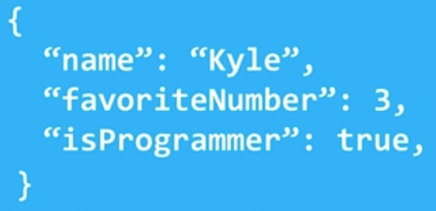

# JSON Types #

* **Strings**
  * "Hello World" "Test" "I"
* **Numbers** including integers, floats, and scientific notation
  * 10 1.5 -30 1.2e10
* **Booleans**
  * true false
* **null**, or none in python 
  * null
* **Arrays** or lists in python 
  * [1, 2, 3] ["Hello", "World"]
* **Objects** or dictionaries in python 
  * {"key":"value} {"age":30}
  * 
